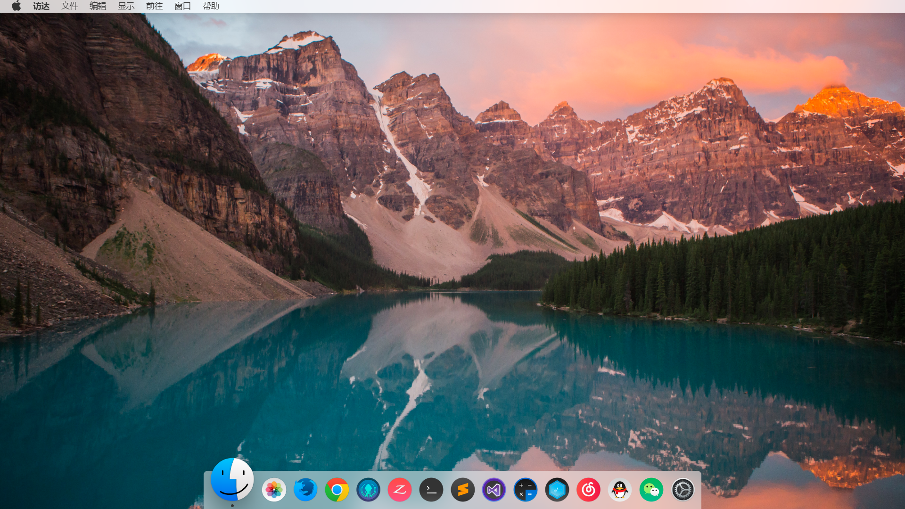

# 说明

使用 css grid 技术来模拟 MacOS 桌面效果

# 截图

# TODO

- 工具栏细节完善 - 显示状态标识
- 桌面上添加一些图标

# 没有模糊效果?

- chrome 
> From version 47: this feature is behind the Enable Experimental Web Platform Features preference. To change preferences in Chrome, visit chrome://flags.

- firefox
>  From version 70: this feature is behind the layout.css.backdrop-filter.enabled preference (needs to be set to true). To change preferences in Firefox, visit about:config.

# 使用资源

| 名字 | 地址 |
| ---- | ---- |
| 图标 | https://github.com/vinceliuice/McMojave-circle |
| 背景图片 | <a style="background-color:black;color:white;text-decoration:none;padding:4px 6px;font-family:-apple-system, BlinkMacSystemFont, &quot;San Francisco&quot;, &quot;Helvetica Neue&quot;, Helvetica, Ubuntu, Roboto, Noto, &quot;Segoe UI&quot;, Arial, sans-serif;font-size:12px;font-weight:bold;line-height:1.2;display:inline-block;border-radius:3px" href="https://unsplash.com/@garrettpsystems?utm_medium=referral&amp;utm_campaign=photographer-credit&amp;utm_content=creditBadge" target="_blank" rel="noopener noreferrer" title="Download free do whatever you want high-resolution photos from garrett parker"><svg xmlns="http://www.w3.org/2000/svg" style="height:12px;width:auto;position:relative;vertical-align:middle;top:-2px;fill:white" viewBox="0 0 32 32"><title>unsplash-logo</title><path d="M10 9V0h12v9H10zm12 5h10v18H0V14h10v9h12v-9z"></path></svg>garrett parker</a> |
